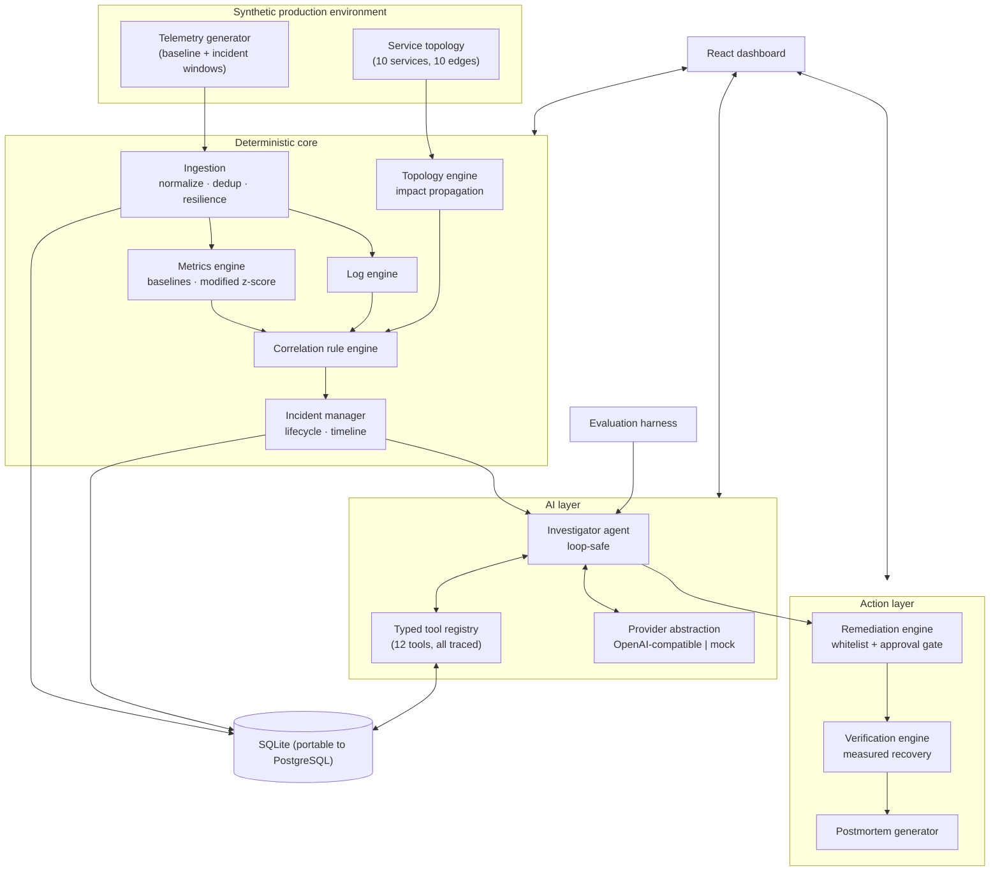
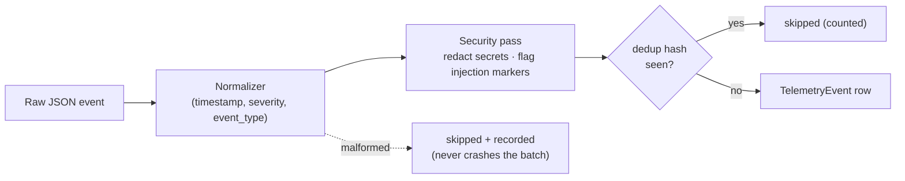

# Aletheia Architecture

## System overview



## Telemetry flow



## Incident lifecycle

```
open → investigating → mitigated → resolved
              ↑            ↑          ↑
        agent runs     remediation   verification outcome = recovered
                       executed     (measured vs baseline, PARTIAL allowed)
```

State transitions are driven by evidence:
- `open → investigating`: an investigation completes (hypotheses stored).
- `investigating → mitigated`: an approved remediation executes in the
  simulation.
- `mitigated → resolved`: ONLY when post-remediation telemetry shows recovery
  (`verification.outcome = recovered`). Nothing else may resolve an incident.

## Anomaly detection (interpretable by design)

`detect_anomalies` compares the last 5 minutes against a 60-minute baseline
using the **Iglewicz-Hoaglin modified z-score** (median + MAD·1.4826). The
median/MAD form is robust to a gradually-developing incident polluting the
tail of its own baseline window — a plain mean/stddev z-score measurably
fails in that case (observed z≈2.5 for a 145% change during development).

Every anomaly carries an explanation with real values:

> `orders-db/db_connections increased from 41.2 baseline to 98.7 (z=16.63, 140% change over last 5m vs prior 60m baseline)`

## Correlation rule engine

Rules are isolated classes evaluated over a shared `CorrelationContext`
(anomalies, error logs, deployments, topology). Each returns a candidate
incident with category, severity, confidence, affected services, and evidence
hints. `DatabaseExhaustionRule`, `DeploymentRegressionRule`,
`ResourceSaturationRule`, `CacheFailureRule`, `DependencyTimeoutRule`.

Deduplication: a new candidate is skipped if an open incident already exists
with the same category and overlapping affected services. **One incident, not
an alert storm.**

## AI investigation

The agent never jumps from "errors" to "database". The loop:

1. **UNDERSTAND** — `get_incident`, `get_topology`
2. **COLLECT EVIDENCE** — per affected service: `get_service`,
   `compare_metrics` (every metric), `query_logs`
3. **TOPOLOGY** — `get_impact_radius` (who is downstream of whom)
4. **DEPLOYMENTS** — `get_deployments`
5. **HYPOTHESES** — the LLM (or deterministic mock) generates ranked
   hypotheses from the collected evidence JSON only
6. **RANK** — confidence = f(anomaly z, causal-kind prior, correlation-category
   agreement); symptom kinds (generic latency/error) are demoted below
   root-state kinds (connection-pool, memory, cache)
7. **RECOMMEND** — one action derived from the top hypothesis
8. **PERSIST** — hypotheses, evidence rows, remediation proposal, agent run,
   tool-call trace

Deterministic fallback: if the LLM returns nothing parseable, hypotheses are
derived directly from the collected anomalies — the investigation never
dead-ends when AI is unavailable.

Loop safety: max tool calls (40), repeated-call detection, wall-clock budget.
The system prompt binds telemetry as **DATA** (see docs/SECURITY.md).

## The AI + deterministic split

| Deterministic (never delegated to LLM) | AI (LLM or mock) |
|---|---|
| metric math, baselines, z-scores | hypothesis generation |
| correlation rules, severity | hypothesis ranking rationale |
| topology propagation | natural-language investigation summary |
| approval gating, action whitelist | remediation reasoning |
| recovery measurement | postmortem narrative |
| dedup, parsing, redaction | |

## Provider abstraction

`LLMProvider` protocol with two implementations:
- `OpenAICompatibleProvider` — any `/chat/completions` endpoint (OpenAI,
  vLLM, Ollama, LM Studio). Credentials arrive ONLY via environment
  (`Aletheia_LLM_*`).
- `MockProvider` — deterministic, zero-cost. Parses the evidence JSON block
  from the prompt and derives hypotheses from real collected values.

## Remediation control

Whitelist: `rollback_deployment, restart_service, scale_service,
clear_cache, increase_connection_pool, disable_feature_flag`.

Modes: `analysis | recommend | approval_required (default) | simulation |
execute`. Execution is **blocked** unless `approval_state == approved` when
mode is `approval_required`. Executing generates recovery telemetry in the
simulation and records initiator, reason, params, expected effect, result.

## Verification

Post-remediation metric means are compared against the pre-incident baseline
and the incident peak. `gap_closed_pct = (peak − post) / (peak − baseline)`.
Outcome: `recovered` (all signals closed ≥60% of the gap), `partial`,
`not_recovered`, or `unknown` (insufficient samples). Each checked metric
appears in the evidence list with its actual numbers.

## Evaluation harness

Five scenarios with known root causes run in **isolated in-memory databases**
(one scenario's telemetry can never contaminate another's baseline windows).
Each is scored on root-cause accuracy, affected-service accuracy, remediation
correctness, recovery verification, evidence count, tool calls, and duration.
See docs/EVALUATION.md.

## Observability of Aletheia itself

`AgentRun` + `ToolCall` record: tool name, args, duration, status, result
summary, token estimates, LLM request counts, stop reason. The UI exposes the
full trace — the observability platform is itself observable.

