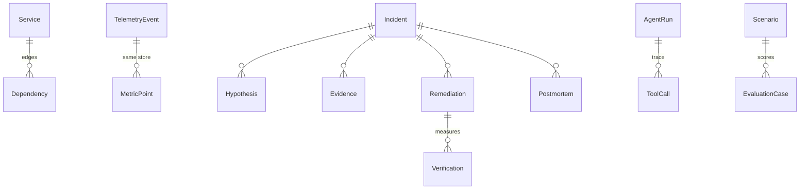

# Incident Data Model

Core entities and their lifecycle semantics. All in `backend/app/models.py`.

## TelemetryEvent
The universal normalized record. `timestamp, service, environment,
severity (DEBUG..CRITICAL), event_type, message, metadata_json,
trace_id, dedup_hash, raw_source ("synthetic" | "external")`.
- **Dedup:** `dedup_hash` = sha256(timestamp|service|event_type|message|
  metadata); duplicates are skipped and counted.
- **Resilience:** malformed entries never crash a batch; parse errors are
  recorded in `IngestionStats`.

## MetricPoint
`timestamp, service, metric_name, value`. Sampled per service per metric.
The engines compute baselines and anomalies from these — no derived values
are stored as if observed.

## Service / Dependency
Synthetic environment nodes (`service | database | external`) and directed
edges (`depends_on | uses`, `critical` flag). The in-memory `TopologyGraph`
answers: dependencies, dependents, descendants, `impact_radius` (who suffers
if X degrades), and `propagation_path` (root → direct → downstream → user).

## Incident
`status: open → investigating → mitigated → resolved`.
- `open → investigating`: investigation completed (hypotheses stored).
- `investigating → mitigated`: approved remediation executed in the
  simulation.
- `mitigated → resolved`: ONLY via `verification.outcome = recovered`.
- `confidence` = correlation-engine confidence; `root_cause_confidence` =
  engineering estimate from the top hypothesis.
- `scenario_id` binds synthetic ground truth (evaluation uses it).

## Hypothesis
`statement, confidence (0-1 engineering estimate), evidence_for[],
evidence_against[], rank, verdict (most_likely | considered | rejected)`.
Ranked by anomaly strength + causal-kind prior + correlation-category
agreement; symptom kinds demoted below root-state kinds.

## Evidence
`kind (metric | log | deployment | topology | analysis), description,
source_ref, observed_at, details`. Metric rows carry real current/baseline
numbers; log rows are secret-redacted; analysis rows quote rule findings.

## Remediation
`action (whitelisted), target_service, params, reason, expected_effect,
risk (low|medium|high), status (proposed→approved→executed|rejected|failed),
approval_state (pending→approved|rejected), initiated_by, approved_by,
executed_at, result`. The approval gate is enforced in `execute_remediation`.

## Verification
`outcome (recovered | partial | not_recovered | unknown), checked_metrics[]
(per-metric peak/post/baseline/gap_closed_pct), evidence[], checked_at`.
Only this entity can transition an incident to `resolved`.

## Postmortem
`content_markdown` generated exclusively from stored records; `generated_by`
records whether rule-based or LLM narrative was used.

## AgentRun / ToolCall
`AgentRun`: provider, model, token estimates, LLM request count, status,
stop_reason (loop-safety evidence). `ToolCall`: seq, tool_name, args,
result_status, duration_ms, result_summary, error — the agent's flight
recorder.

## EvaluationCase
Per-benchmark result: known vs predicted root cause, booleans for
RC/services/remediation/recovery, evidence/tool counts, duration, score.
Scenario DBs are isolated in-memory instances; cases persist in the main DB.
